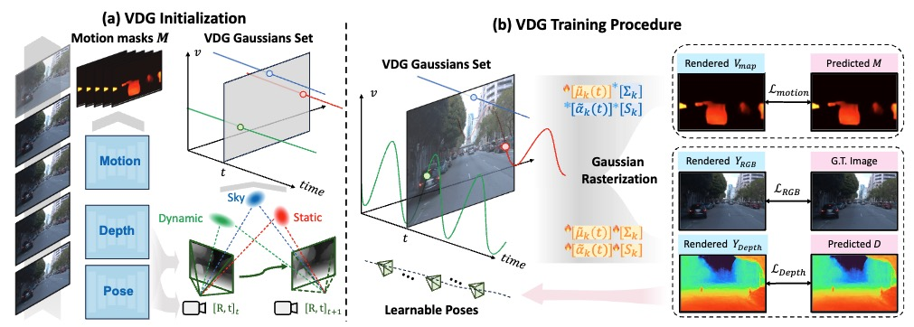

# VDG: Vision-Only Dynamic Gaussian for Driving Simulation
### [[Project]](https://3d-aigc.github.io/VDG/) [[Paper]](https://arxiv.org/pdf/2406.18198.pdf) 

> [**VDG: Vision-Only Dynamic Gaussian for Driving Simulation**](https://arxiv.org/pdf/2406.18198.pdf),            

**Official implementation of "VDG: Vision-Only Dynamic 
Gaussian for Driving Simulation".** 

## 📹 Video

## 🛠️ Pipeline

  

 

## Getting Started

Code coming soon~
